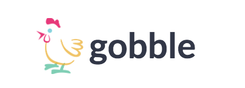

  </img>

**Gobble** is a full-stack single page messaging application inspired by Slack. It uses Ruby on Rails on the backend to produce a 'RESTful' API and React/Redux on the frontend. It also features Pusher to implement WebSockets seamlessly.

## Development Timeline

1. **[DONE]** User Authentication
2. **[DONE]** Landing Page
3. **[DONE]** Pusher Implementation
4. **[DONE]** Channels
5. **[DONE]** Channel Search
6. **[DONE]** Channel Group Messages
7. Direct Messages
8. Online/Offline User Activity
9. Paperclip Implementation
10. User profile photo
11. User photo messaging
