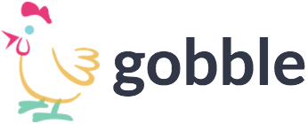
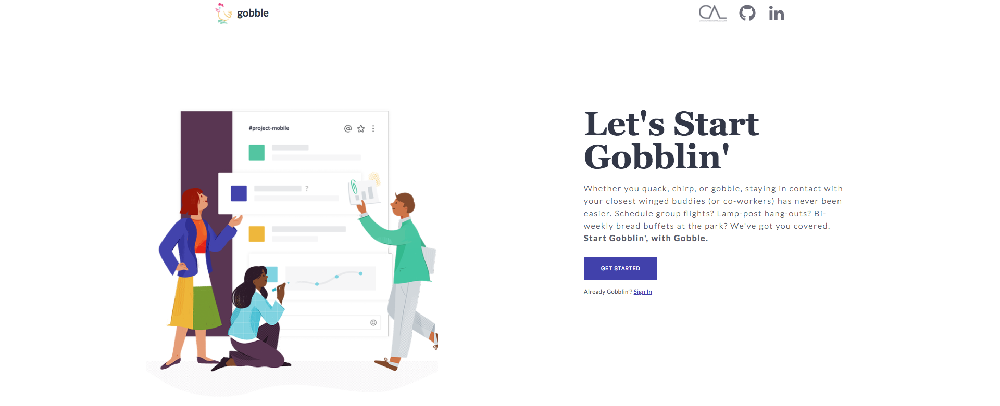
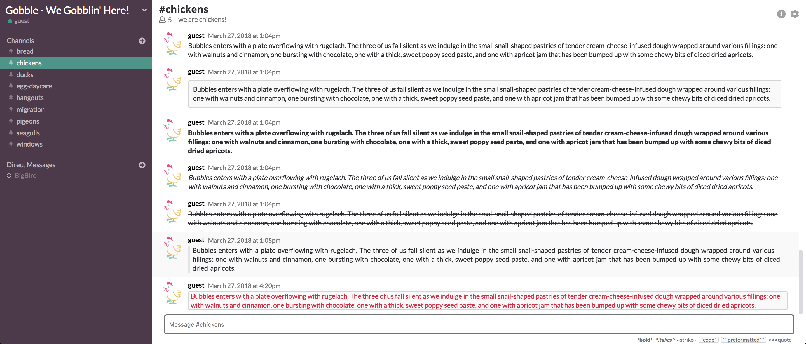

<div align="center">
  </img>
</div>

# Background

**Gobble** is a full-stack single page messaging application inspired by Slack. It uses Ruby on Rails on the backend to produce a RESTful API and React/Redux on the frontend. It also features Pusher to implement WebSockets seamlessly.

[Gobble Live-Demo](https://gobble-gobble.herokuapp.com/#/)

<div align="center">
  </img>
</div>

# Features

* User Authentication with automated demo-login using Devise
* Live-Messaging
* Message Formatting
* Notifications
  * Current Channel Notifications
* Channels
* Direct Messages
* Group Messages
* User Presence (Online, Offline)

## User Authentication with automated demo-login using Devise

Users can use the demo-login provided to sign into Gobble. Authentication is implemented using the Devise gem.

```ruby
class Users::SessionsController < Devise::SessionsController
  def create
    @user = User.find_for_database_authentication(username: params[:user][:username])
    errors = {}

    if @user && @user.valid_password?(params[:user][:password])
      sign_in @user
      render 'api/users/show'
    else
      if User.find_by(username: params[:user][:username]) == nil
        errors[:username] = ['Invalid Username.']
      end

      errors[:password] = ['Invalid Password.']
      render json: errors, status: 401
    end
  end

  def destroy
    if current_user
      render json: current_user
      sign_out current_user
    else
      render json: ["No one is logged in!"], status: 404
    end
  end
end
```

## Live-Messaging

### Pusher & WebSockets

Using Pusher to interact with WebSockets, live-messaging between users in channels, direct messages, and group messages are seamless and intuitive.

Pusher triggers an action for a specified channel whenever a new message is created:

```ruby
  def create
    @message = Message.new(message_params)
    @message.author_id = current_user.id

    if @message.save
      Pusher.trigger('channel_messages', 'message_created', {channelName: @message.channel.name})
      render 'api/messages/show'
    else
      render json: @message.errors.messages, status: 422
    end
  end
```

The messages components then subscribe to these actions on mounting and respond accordingly:

```javascript
let that = this;
this.channelMessages = this.pusher.subscribe("channel_messages");
this.channelMessages.bind("message_created", function(data) {
  that.getChannelMessages(that.props.currentChannel.name);
});
```


### Message Formatting

Gobble currently supports the following message formats:

* Bold (wrapping text in \*'s)
* Italics (wrapping text in ^'s)
* Strikethroughs (wrapping text in ~'s)
* Code Snippet (wrapping text in " ` "s)
* Preformatted Snippet (wrapping text in " ``` "'s)
* Quotes (starting text with ">>>")



### Grouped Messages

When a user messages in a channel consecutively, those messages are grouped so that the user's avatar isn't always being displayed at each message. The time threshold to group these messages is between 1 day.

### Video Links

Message will render an embedded video player for users to view within the application (currently only supports YouTube)


## Notifications

When the user is viewing a current channel, direct message, or group message, and an incoming message is delivered, the messages component renders a "new messages" banner or automatically scrolls down to the most recent message depending on the current user's scroll height when viewing messages. If the "new messages" banner is rendered, the user can click on it to view the new message(s).


## Channels / Direct Messages / Group Messages

### Channel Search

Users can browse existing channels via live-search. In the same component, they can also see which channels they currently belong to and those they can join. Viewing any channel from the channel search component is as simple as a click of a button.


### Channel Creation

Users can create their own channel from the channel creation form. Error handling is done on the front-end for immediate feedback on whether or not the current channel parameters are valid. If invalid, the applicable input fields will render a red border around themselves and the 'Create Channel' button will be disabled and 'greyed out' for the user to visibly be notified that their input is invalid.


### Direct Messaging and Group Messaging

Direct messages and group messages can be created under the same 'create direct message' menu. Before opening a direct/group channel, a validation checks if that particular direct/group channel relationship currently exists in the database. If it does, the user is re-routed to the URL path of that direct/group channel. If not, the direct/group channel is created in the database and then the user is routed to the URL path of the newly created channel.

To prevent other users from viewing direct messages that they aren't associated with via an ID enumeration attack, a validation is done to check if the current user actually belongs to the direct message they are trying to access. If they aren't, the user is redirected to their last visited channel.


### User Presence

Users can view if other users are online or offline either through the direct messages portion of the sidebar, the header in the direct message component, or the channel/group detail that can be accessed within those respective channel components.

# Development Timeline

1.  **[DONE]** User Authentication
2.  **[DONE]** Landing Page
3.  **[DONE]** Pusher Implementation
4.  **[DONE]** Channels
5.  **[DONE]** Channel Search
6.  **[DONE]** Channel Group Messages
7.  **[DONE]** Direct Messages
8.  **[DONE]** Online/Offline User Activity
9.  **[DONE]** Message Formatting
10. Notifications
11. Paperclip Implementation
12. User profile photo
13. User photo messaging
