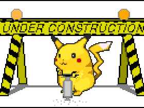

# Gobble

**Gobble** is a full-stack single page messaging application inspired by Slack. It uses Ruby on Rails on the backend to produce a 'RESTful' API and React/Redux on the frontend.

  </img>

